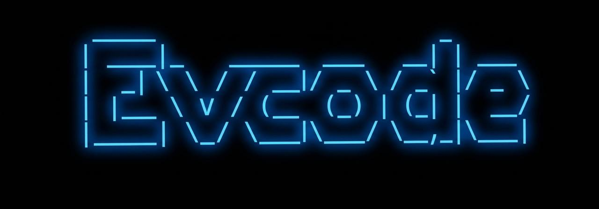
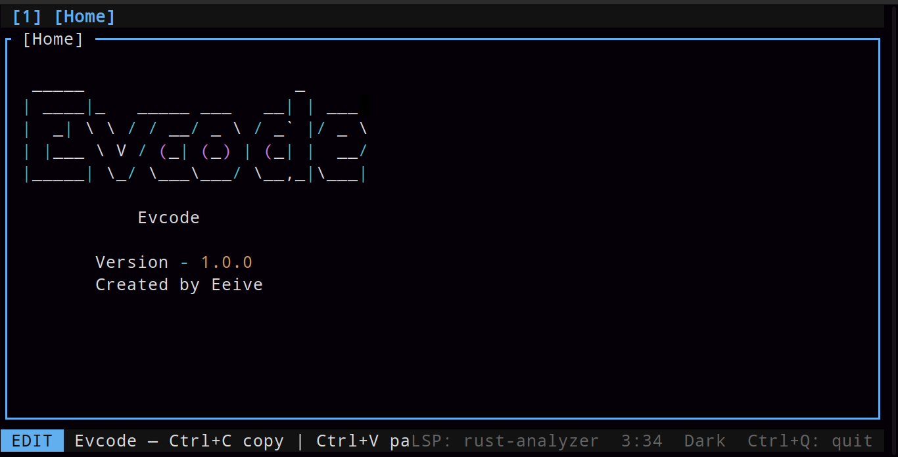
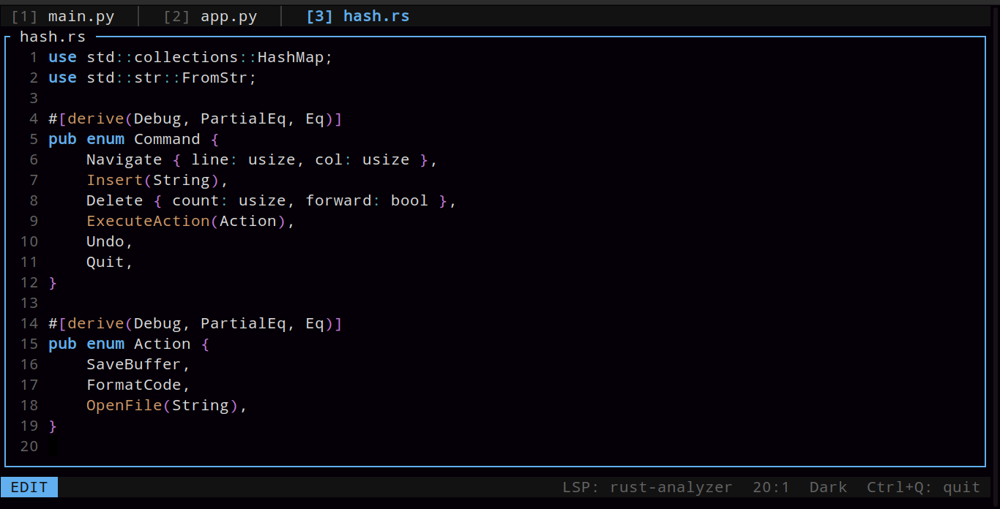
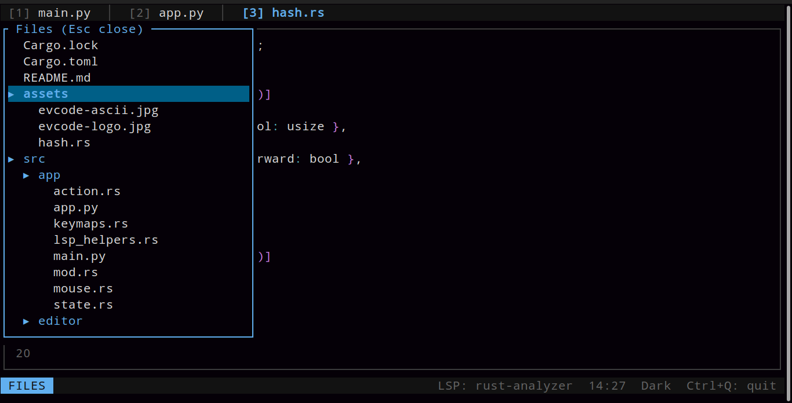
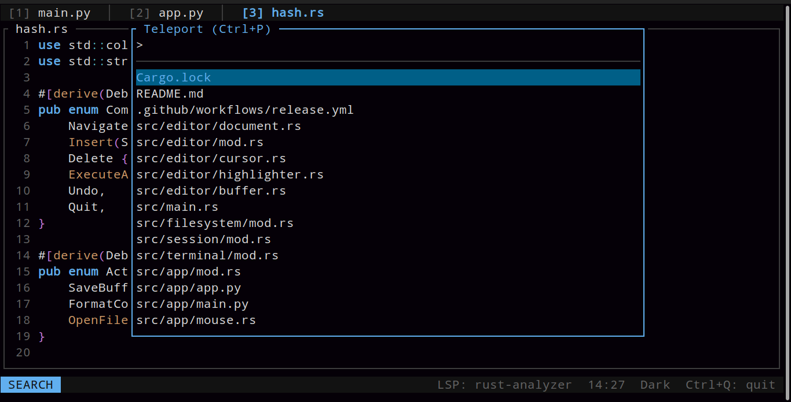
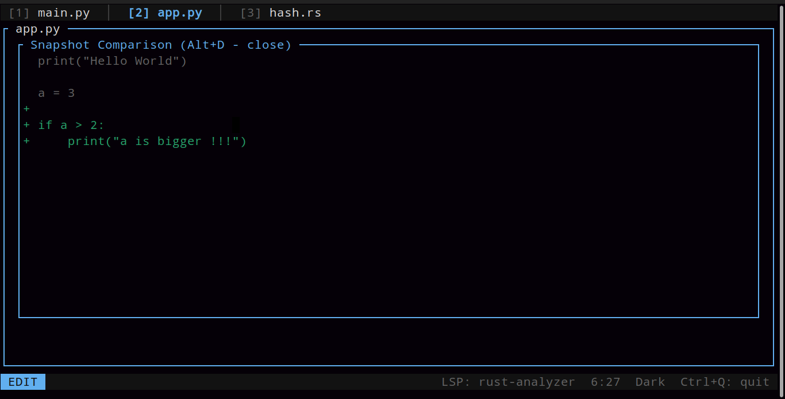
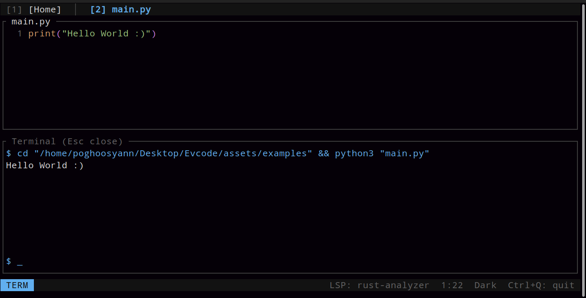

<p align="center">
  
</p>

<h1 align="center">Evcode</h1>
<p align="center">
  <b>Ghost-powered Terminal IDE built with Rust</b><br>
  Fast | Lightweight | Minimal | Developer-focused
</p>

---

# Overview

**Evcode** is a modern terminal IDE written in **Rust** for developers who want speed, focus, and precision without heavyweight GUI editors.

Evcode combines the responsiveness of terminal editors with IDE-level functionality such as:

- ⚡ Fast editing
- 🧠 LSP integration
- 👻 Ghost snapshots & rollback
- 📁 File explorer
- 🔍 Teleport fuzzy search
- 🖥 Integrated terminal
- 🎨 Theme system
- 📋 Native clipboard support

Designed around a minimal workflow, Evcode stays lightweight while still giving you powerful tools for real development.

---

# Why Evcode?

Most IDEs become heavy and distracting.

Evcode follows a different philosophy:

> Stay inside the terminal.  
> Keep the editor fast.  
> Keep the workflow focused.

Built with Rust and Ratatui, Evcode aims to deliver instant interaction and a distraction-free coding experience.

### Performance

- ~7-10 MB RAM usage (idle)
- Lightweight TUI rendering
- Fast startup
- Efficient text buffer handling
- Minimal system overhead

---

# The Ghost System

Evcode introduces a unique **Ghost workflow**.

Instead of relying on temporary Git commits during experimentation, Ghost lets you save, compare, and restore editor states instantly.

## Ghost Snap — `Alt + S`

Create a lightweight snapshot of the current buffer.

Think of it as a game save state for code.

Ghost snaps:

- Save instantly
- Live in RAM for speed
- Mirror to:

```bash
~/.local/share/evcode/snaps/
```

for persistence and safety.

---

## Ghost Diff — `Alt + D`

Compare your current code against a Ghost snapshot.

Ghost Diff highlights:

- Added lines
- Removed code
- Modified sections

without leaving the editor.

Perfect for:

- Refactoring
- Experimentation
- Reviewing logic changes
- Comparing ideas quickly

---

## Ghost Rollback — `Alt + R`

Instantly revert to the last Ghost snapshot.

No:

- Git reset
- Manual undo chains
- Lost work

Just rollback and continue.

---

# Features

## Editing

- Multi-tab editing
- Syntax highlighting
- Selection support
- Undo / Redo
- Clipboard integration
- Efficient cursor navigation

## Language Intelligence

Built-in **LSP support** provides:

- Diagnostics
- Error highlighting
- Language awareness
- Real-time feedback

Supports languages with available LSP servers, including:

- Rust
- Python
- JavaScript / TypeScript
- C / C++
- And more

---

## Teleport Search

### `Ctrl + P`

Teleport is Evcode's high-speed fuzzy file finder.

Quickly jump between project files without manually browsing folders.

Designed for:

- Large projects
- Fast navigation
- Keyboard-first workflows

---

## Integrated Terminal

Run commands without leaving Evcode.

Compile, test, or run scripts directly inside the IDE.

Useful for:

- Cargo
- Python
- Node
- Build systems
- Shell commands

---

## File Tree

Browse project structure directly inside the editor.

Useful for:

- Opening files
- Project navigation
- Folder inspection

---

# Installation

## Build from source

```bash
git clone <repo-url>
cd evcode
cargo build --release
```

Run:

```bash
./target/release/evcode
```

---

## Cargo

```bash
cargo install evcode
```

---

# Hotkeys

## File & Editor

| Shortcut | Action |
|---|---|
| Ctrl + S | Save file |
| Ctrl + W | Close tab |
| Ctrl + Q | Quit Evcode |
| Ctrl + Z | Undo |
| Ctrl + Y | Redo |
| Ctrl + A | Select all |
| Ctrl + C | Copy |
| Ctrl + X | Cut |
| Ctrl + V | Paste |

---

## Navigation

| Shortcut | Action |
|---|---|
| Ctrl + P | Teleport search |
| Ctrl + B | Toggle file tree |
| Ctrl + E | Next tab |
| Ctrl + Shift + A | Previous tab |
| Shift + Arrows | Text selection |

---

## Ghost System

| Shortcut | Action |
|---|---|
| Alt + S | Ghost Snap |
| Alt + D | Ghost Diff |
| Alt + R | Ghost Rollback |

---

## Interface

| Shortcut | Action |
|---|---|
| Ctrl + T | Toggle theme |
| Ctrl + ` | Toggle terminal |

---

# Project Goals

Evcode is built around a few simple ideas:

- Terminal-first development
- High performance
- Clean UI
- Keyboard-driven workflow
- Minimal friction
- Fast experimentation

The goal is not to become a bloated editor.

The goal is to stay fast.

---

# Tech Stack

- Rust
- Ratatui
- Rope-based text editing
- LSP architecture
- Terminal UI rendering

---

# Examples

## Home Screen

<p align="center">
  
</p>

## Editor Workspace

<p align="center">
  
</p>

## File Tree

<p align="center">
  
</p>

## Navigation

<p align="center">
  
</p>

## Snapshot

<p align="center">
  
</p>

## Terminal

<p align="center">
  
</p>

<p align="center">
  <i>Evcode running inside the terminal</i>
</p>

# License

MIT License

---

<p align="center">
Made with Rust by <b>Eeive</b>
</p>